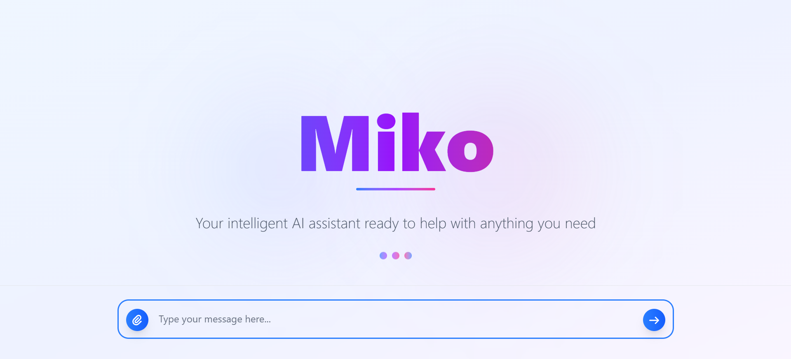
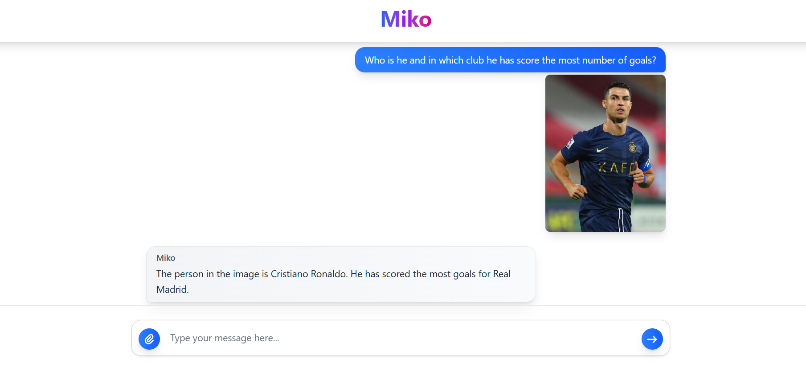

# 🤖 Miko - AI Chat Assistant

A full-stack AI chat application with a React + TypeScript frontend and a Spring Boot backend powered by Google's Gemini AI.



## ✨ Features

- 🤖 Chat with Gemini AI
- 🖼️ Upload images and discuss with AI
- 🎨 Modern, responsive UI with gradients and glassmorphism

## 🛠️ Tech Stack

- **Frontend:** React, TypeScript, Vite, Tailwind CSS
- **Backend:** Spring Boot, Spring AI, Google Gemini

## 🚀 Getting Started

### 📦 Prerequisites

- Node.js (v18+)
- Java 21+
- Maven 3.6+
- Google Gemini API Key ([Get it here](https://ai.google.dev/))

### 🖥️ Backend Setup

1. **Clone the repository and go to backend folder:**

   ```bash
   git clone <repository-url>
   cd spring-ai-demo-frontend-project/backend
   ```

2. **Add your Gemini API key to `src/main/resources/application.properties`:**

   ```properties
   spring.ai.google.genai.api-key=${GEMINI_API_KEY}  // Put your Gemini API key here
   ```

3. **Start the backend:**

   ```bash
   ./mvnw spring-boot:run
   # or
   mvn spring-boot:run
   ```

   The backend runs at `http://localhost:8080`

### 💻 Frontend Setup

1. **Go to the frontend folder:**

   ```bash
   cd ../frontend
   ```

2. **Install dependencies:**

   ```bash
   npm install
   ```

3. **Start the frontend:**

   ```bash
   npm run dev
   ```

   The frontend runs at `http://localhost:5173`

## 🎉 Chat Example



## 📬 Contact

For any further queries, feel free to reach out:

**Email:** mainakcr72002@gmail.com
